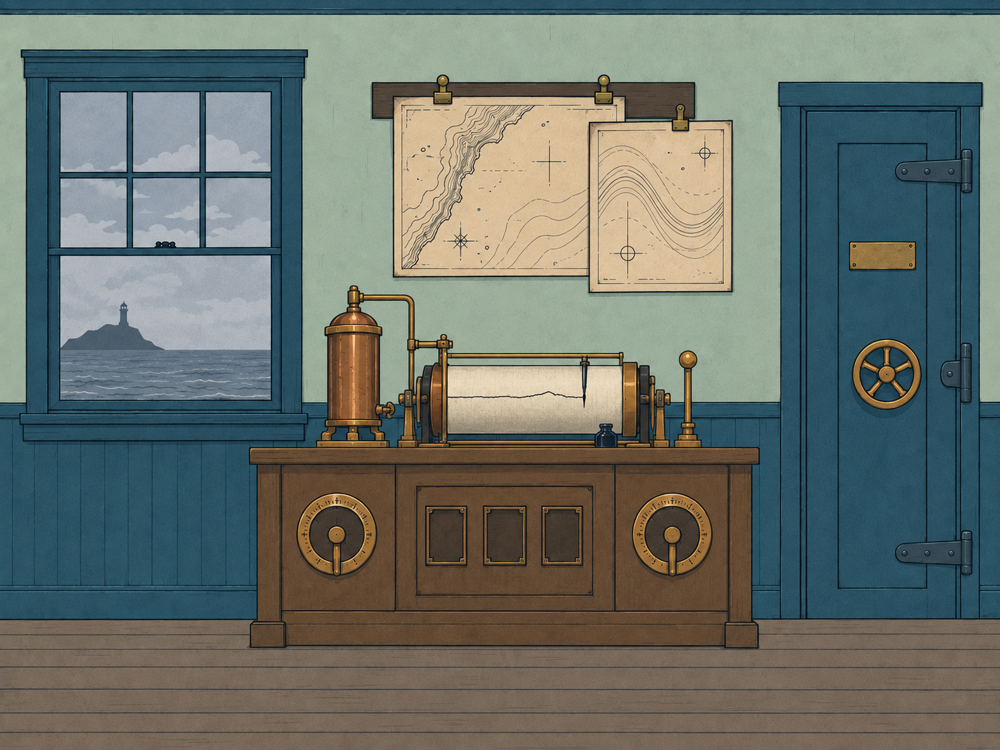

# Chart Room asset development

## Master illustration v1

The R03 arrival master establishes a second room in the station's approved visual language: a flat front elevation, sea-glass plaster, blue wainscoting, fine ink contours, and restrained copper and paper accents. The sea window anchors the left side, the recorder occupies the central cabinet, and the sealed observation hatch remains visible at right.

File: `art/concepts/chart-room-arrival-v1.png`, 1448 x 1086 pixels, 4:3. The exact built-in image-generation prompt and reference provenance are in `chart-room-generation-v1.json`.

This is a composed concept master. A runtime copy at `assets/backgrounds/chart_arrival.png` now provides the backdrop for the playable map workbench. Authored map-face overlays and native controls supply P03 interactions; the recorder, lever and hatch remain decorative. Generated dial ticks are placeholders, not solvable evidence.

## Production assets and remaining work

### P03 prop concept v1

`art/concepts/chart-room-p03-props-v1.png` proposes three visible pickup sites within the original room composition: a torn upper chart on its outlined board, an open shallow cabinet drawer with a protruding middle fragment, and a brass weight holding the lower fragment on the window sill. This is a concept for user review, not an approved replacement or integrated runtime plate. The generation prompt and references are in `chart-room-p03-generation-v1.json`.

The generated paper shapes and contour marks illustrate presentation only. Replace them with the coherent authored P03 map geometry for playable clues. Preserve the established window, recorder, dials, sockets and hatch; derive closed/open/collected prop layers after visual review. The concept remains a composed image, so it does not yet supply those separate states. Current runtime art and the original arrival master are preserved.

### Remaining asset groups

| Asset group | Required behavior | GDD puzzle |
| --- | --- | --- |
| Torn tide sheet | Three matching upper-coastline, middle-shoal, and lower-soundings fragments; full-sheet assembly outline, completed sheet, visible chart-weight pickup, and chart-drawer open/closed states | P03 |
| Tide-sheet comparison | Reconstructed sheet and intact reference with matching date and north marks, lighthouse registration crosses, clips, and a composite crossing interval band 3 | P03 |
| Recorder controls | Separate ZERO and INTERVAL controls, authored labels and readable values, mismatch feedback, and CALIBRATE lever states; correct settings are 4 and 3 | P04 |
| Observation plates | Separate boundary, relation, and observer plates, three sockets, and a RECORD control | P05 |
| Recording paper | Blank paper and a runtime text area for the player's last three recognized completed interactions | P05 |
| Observation hatch | Closed/open states and the dry-stair threshold; its pressure gate still blocks descent | P04-P05 |
| Window and atmosphere | Separate exterior scenery, rain, reflections, interior color treatment, and local anomalies, all driven by puzzle progress | Shared tide state |

Author clue-bearing numbers, symbols, diagrams, and text from deterministic SVG or runtime text sources. Keep the scale and positions of the cabinet, window, and hatch fixed when separating production layers. Do not independently regenerate complete room geometry for each weather state.

Every map shown in a playable room needs an inspectable close-up, even when it carries only atmosphere. For this room, author the maps at a scale that supports useful zoom and pan, plus readable annotations and a completed-sheet reference. Fragment geometry must come from one coherent source sheet. The current master shows two intact decorative sheets and a cabinet without an authored chart-drawer hotspot; a production revision must show the torn-sheet state, its outlined board, and the clearly accessible drawer and chart weight required by GDD 1.2. The composed illustration does not itself supply those functional prop states.

The playable pass now supplies nine SVG/PNG map assets, a zoomable viewer with transcripts, three-fragment assembly, chart comparison, and saved evidence. Native labeled prop buttons make the board, unlocked drawer and paper under the weight operable. Final physical drawer/weight art and animations remain to replace those explicit workbench controls. P04-P05 remain unimplemented. See `map-interaction.md` for the current walkthrough and integration boundaries.

Use tap-to-select and tap-to-place as well as optional drag; give step rotation and visible zoom controls so neither assembly nor inspection depends on precise gestures. Preserve partial assembly and observed map versions in the eventual game state. See the inspectable-maps section and P03 in `design/game-design.md` for the complete rule.

## Environmental direction

- Arrival: ordinary gray sea, visible lighthouse, quiet readable room. A pen scratching against a motionless drum supplies the first discrepancy once animated and given sound.
- P06 and P09 milestones: lower cloud, rain, reduced exterior contrast, and dampness below the window.
- Later tides: exterior detail disappears while the recorder continues reporting conditions that cannot be seen. Subsequent chart anomalies can orient compass lines toward the observer, as specified in the GDD.
- The darkest state must preserve the legibility of puzzle controls, paper, symbols, and the hatch.

The illustration currently contains only the arrival state. No weather layers, moving pen, sound files, or later room states have been produced in this pass.

## Inspection

Visually checked against the approved Intake Office: front elevation, matching palette and outlines, readable instrument and hatch silhouettes, no angled walls or receding tabletop. PNG dimensions and encoding were checked. This concept inspection does not establish in-engine or iPad validation.
